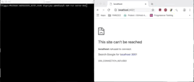

# About
A simple demo to establish an echo socket connection with a nodejs server

## Steps to run
1. Run `npm installl`
2. Run `npm run serve-dev`
3. Launch `http://localhost:3001`in browser

## Demo

